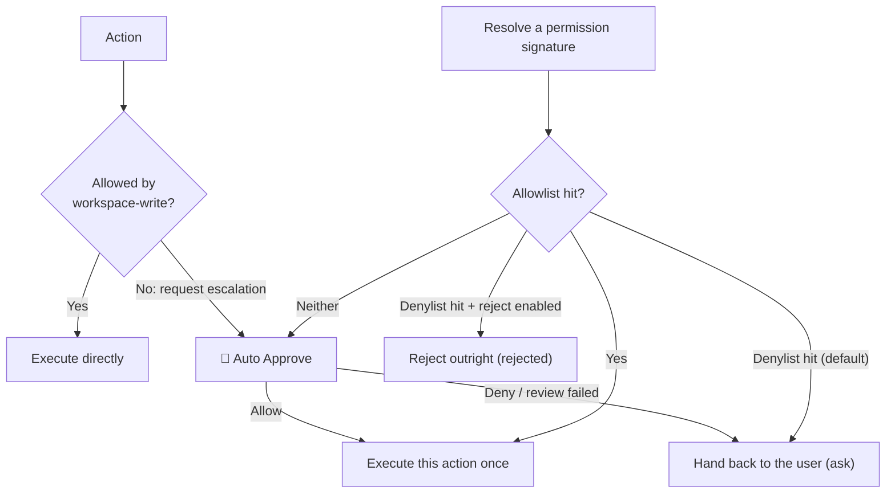

# dsh-auto-pass

English | [中文](README.zh.md)

`dsh-auto-pass` adds a `自动审批` (Auto Approve) permission preset to the DeepSeek Harness Web UI. Each action that requires approval goes through a single-shot model review (no child Agent, no transcript: just the normalized action plus your last message), and the plugin only auto-approves the requests that pass that review. A model denial, a host safety downgrade, and a failed review are all handed back to DSH's normal approval chain, so the user decides. The one exception is the **"reject on denylist"** switch in the settings (off by default): once you turn it on, a denylist hit fails the tool call outright instead of opening an approval card.

On top of that sit two layers of *permission memory*: an **allowlist** (allowed directly from then on, with no model call) and a **denylist** (handed to you directly, with no model call), both at **project** and **global** scope. A rule comes from one of three places: your own promote/demote action in the timeline, the suggested rule the Reviewer returned with its review, or **the confirmation prompt that follows a threshold** — after the same permission in the same project has been approved (default 3 times; auto-approvals and your own approvals both count) or denied (default 3 times; model denials and your own rejections both count) in a row, the plugin asks whether to add it to the allowlist/denylist (this project / global / do not add), using the match condition the review already returned — or this exact signature when the review had none (no extra model call). Nothing is written until you confirm, and answering "do not add" stops the plugin from asking about that action again.

The current release supports the Web UI only.

## Screenshots

Select the `自动审批` permission preset (DSH 0.1.5-rc.1, English UI):


The Reviewer allows a bounded read-only action:


## How it works



With `Auto Approve` selected, ordinary actions permitted by `workspace-write` run without a Reviewer call. The diagram shows the sandbox-escalation path; other tool approval rules can also trigger Auto Approve.

- The plugin handles `approval/request` only when the session selects `Auto Approve`. Other permission presets continue through DSH's existing approval chain.
- Each approval is one plain `llm.stream` call. The review gets no child Agent, no tools, no file access and no session history, so it cannot investigate — it decides from what it is handed.
- The prompt is two JSON sections: the normalized action (tool name, command/paths, cwd, whether an escalation was requested) and minimal context (your last user message plus the most recent `ask_user_question` answer, each truncated to `maxEvidenceChars`, 400 by default). Only those two can establish authorization; anything else is not in the prompt at all.
- Only `outcome` is required in the structured result. A compact `{"outcome":"allow"}` defaults to low risk and unknown authorization; omitted fields on a denial default to high risk and unknown authorization. Explicit assessments may also contain `risk_level`, `user_authorization`, and `rationale`. The host always denies critical risk and denies high risk without at least medium user authorization. Invalid output, missing action data, timeout, cancellation-independent infrastructure failure, and tool failure are never turned into an automatic denial: they hand the request back to the user.
- A model denial is not re-reviewed and is never turned into an automatic rejection: the plugin calls the next answerer, so the request continues through DSH's normal approval chain and the user decides. The plugin produces exactly two outcomes on its own: `allowed-once` for a review-passed request, and `rejected` when a denylist hit meets the opt-in "reject on denylist" switch (off by default, so a denylist hit normally goes to the user as well).
- **Lists take priority over the model review**: a denylist hit is handed to the user and an allowlist hit is allowed, both without calling the model. The denylist always beats the allowlist, and a project rule beats a global one.
- A **permission signature** is derived from the tool name plus normalized key arguments and is independent of call id and time: command tools use the command text (whitespace collapsed), file tools use path arguments, and everything else uses a key-sorted JSON of its arguments. Extra arguments such as an escalation marker are part of the signature, so an escalated retry is not treated as an ordinary call. The signature is what "similar permission" actually means here.
- **Automatic promotion** counts consecutive approvals of the same action in one project (default 3, counting auto-approvals and your own "allow once" alike) and consecutive denials (default 3). The approval that matched a list rule never counts. When the threshold is reached the plugin asks you (this project / global / do not add) and only writes a rule after you confirm; with no usable model suggestion it writes a **command prefix** (for example `pnpm test`) instead of pinning the whole command as an exact signature. Declining stops future counting and asking for that action.
- When the exact action cannot be resolved (for example the approval request arrives before its `tool/call` event) **no signature is created**. Such requests take part in neither list matching nor counting — otherwise they would all collapse into one empty signature and a few approvals would auto-approve every unresolvable call.
- The default 90-second deadline covers that single streaming call.

The parent session records the approval events and a compact plugin notice (switchable off in the settings, on by default). The notice is injected **after** the approval settles, so it carries both the review verdict and the **final outcome**, for example `[human] Auto Approve did not allow bash; handed to you · final result：rejected · Rationale: ...` — a hand-off therefore shows whether you eventually approved or rejected it. The review itself leaves no child session behind: host logs record the route, risk, authorization and outcome for each review, but not full prompts or file contents.

## Panels: approval policy and approval timeline

Every decision is recorded. The two panels are deliberately kept apart so the conversation area does not fill up with approval noise: **the conversation tab holds "Approval policy", the right sidebar holds the "Approval timeline"**. The host serves data from `/api/dsh-auto-pass/log`, `/policy`, and `/rule`, and the plugin's client half renders it.

"Approval policy" contains the consecutive-approval threshold (applied as soon as you save it, stored in the global section of the policy file), the panel placement, and the allow/deny lists at **global** and **project** scope (each rule shows its label, its source — manual/model/memory — and its match condition, and can be **edited** (change its label or match condition; the rule is updated in place, id kept) or deleted individually; the same rule never shows up twice: adding a rule with the same tool + match condition **updates** the existing one, a rule that an existing broader rule already covers **is not written again**, and a broader rule **merges away** the narrower rules it covers — the panel tells you which of the three happened). The settings card under Settings → Plugins (the same card also sits at the bottom of the "Approval policy" panel) holds the panel placement plus three switches: **inject approval results into the context** (off means nothing about approvals is ever written into the model conversation), **reject on denylist**, and **open the approval timeline automatically** (any approval arriving while the timeline is not on screen reveals it; it never steals focus when the timeline is already showing, and a page reload does not pop it open for older records). All of them live in the DSH settings namespace, apply immediately, and survive restarts. Managing project rules requires knowing the current project directory: the plugin first asks the host's session list and otherwise falls back to the `cwd` of the newest approval record in this session.

The "Approval timeline" has **quick filters** at the top — five chips (`All` / `Allowlist` / `Denylist` / `Auto` / `Human`), each carrying the number of records in the current scope (this session / all sessions); allowlist and denylist look at whether the approval matched a list rule, auto at what the model approved by itself, and human at what you decided — the latter two exclude list hits, so **the four never overlap and their counts add up to the total**; the four **stack** (with several lit, a record matching any of them is shown), while `All` clears the selection. Every row already shows the **review opinion** and the **matched list** (allowlist/denylist + scope + rule label), so you can tell why a request was allowed or handed to you without expanding it; a match condition is a command prefix, an exact signature, or a path prefix (the kinds this action cannot use are disabled, so no rule that can never match gets written) — a path prefix takes a **single-segment** wildcard (`D:/work/x/src/*.js`, files directly in that directory), while a cross-directory `**` is refused; expanding a record lets you **promote it to the allowlist** or **demote it to the denylist**, at "this project" or "global" scope. The rule to add is prefilled with the **suggested rule** the Reviewer produced for that review (model-authored, and able to cover a class of actions such as `command_prefix: pnpm test`), or with a **command prefix** derived from that action when the record has no usable suggestion (for example the review did not finish; an action without a command falls back to its exact signature); **that form is editable** — match kind (command prefix / exact signature / path prefix), match value and label are yours, and the four buttons add exactly what you wrote, with no model in the loop. A suggestion that plainly does not cover the reviewed action (the model has written things like `danger-full-access` as an "exact signature") is dropped and falls back to the exact signature instead of being written into a list.

- Placement follows [`dsh-context`](https://github.com/bowenliang123/dsh-context)'s model: a tab beside Chat/Trajectory in the conversation view (`conversation.view`) holds the policy panel and a right-sidebar tab (`sidebarRightTabs`) holds the timeline, or both. `placement: all` (default) registers both, so the conversation tab is visible at once; `auto` prefers the right sidebar and falls back to the conversation tab when the sidebar seat is unavailable — so the panels also work without any third-party sidebar plugin. Use `tab` or `sidebar` to keep just one.
- A settings card (`settings.plugin.item`, under Settings → Plugins) switches the placement at runtime; the choice is written to the DSH settings namespace `dsh-auto-pass`, survives restarts, and overrides the `placement` config value. Note that Settings only renders cards for plugins that registered a settings namespace host-side, so the host half registers one (the client card's key must equal that namespace).
- Each row shows time, **the turn and step it happened in**, tool name, the verdict (`auto-approved` / `handed to user` / `rejected outright` / `review incomplete`), a review-opinion excerpt, and the matched allowlist/denylist rule when one matched, plus how you answered for a hand-off; expanding it shows risk level, user authorization, turn/step, rationale, approval reason, action arguments (truncated to 500 characters), latency, and token usage.
- Records persist as JSON, survive restarts, and are **split per workspace**: `$DSH_HOME/dsh-auto-pass/records/<workspace>.json` (default `~/.dsh/dsh-auto-pass/records/`; records without a cwd go to `unknown.json`), newest 1000 kept per workspace and written atomically, while the panels read all workspaces merged into one timeline. Upgrading splits the old single `$DSH_HOME/dsh-auto-pass/approvals.json` per workspace (the original is deleted only after every write succeeded; duplicate ids are collapsed). Setting `logFile` explicitly falls back to single-file mode; `maxRecords` caps each workspace. The log stores local approval data only and is served on localhost.
- Policy lives in two files: global `$DSH_HOME/dsh-auto-pass/policy.json` (threshold, global lists, consecutive counters) and project `<session cwd>/.dsh-auto-pass/policy.json` (project lists). Counters always live in the global file and are keyed by `cwd`, so a project directory gains a `.dsh-auto-pass/` directory only once you actually write a project rule for it (that directory is in this repository's `.gitignore`; consider ignoring it in yours too). A failed write only warns: a project rule that cannot be written degrades to a global rule, and policy I/O never changes an approval outcome.

## Install

The package name is `dsh-auto-pass`. Install it from GitHub:

```sh
dsh plugin --profile web add github:sujingkpo/dsh-auto-pass
```

or from a local checkout:

```sh
dsh plugin --profile web add link:/path/to/dsh-auto-pass
```

Restart the Web UI, then select `Auto Approve` in the session Permissions selector or as the default permission preset in General Settings.

## Configuration

The bundled defaults use `deepseek-official/deepseek-v4-flash` with `high` reasoning:

```yaml
- id: dsh-auto-pass
  name: dsh-auto-pass
  config:
    language: auto
    reviewerProvider: deepseek-official
    reviewerModel: deepseek-v4-flash
    reviewerReasoningEffort: high
    timeoutMs: 90000
    maxEvidenceChars: 400
    maxActionChars: 16000
    maxOutputTokens: 2048
    maxRecords: 1000
    placement: all
    notice: true
    denyDirect: false
    autoOpenTimeline: true
    askRejectReason: true
    autoApproveAfter: 3
    policyFile: ''
```

`language` accepts `auto` (default), `zh`, or `en`. An invalid value emits a warning and falls back to `auto`. In `auto` mode, the plugin counts Han characters across direct user messages in the session: four or more selects Chinese; otherwise it selects English. Agent instructions, assistant messages, and tool results do not affect detection. The Reviewer is instructed to write its rationale in the language of the direct user prompt. The security policy itself remains in Chinese in both modes to avoid changing review semantics through translation.

`notice` (default `true`) controls whether approval results are injected into the model context; `denyDirect` (default `false`) controls whether a denylist hit rejects the call outright; `autoOpenTimeline` (default `true`) controls whether an approval opens the timeline automatically whenever it is not already on screen; `askRejectReason` (default `true`) controls whether rejecting an approval asks you for a reason (the first option is that review's model note, one click away; you can also type your own or pick "No comment"). All four can be changed from the settings card or the "Approval policy" panel, and the settings value wins over these defaults. `notice` is the master switch: once it is off, neither approval results nor rejection reasons reach the model context, and the question is skipped too.

`reviewerProvider` and `reviewerModel` must be set together. If both are omitted, the Reviewer uses the parent session's current provider and model. `autoApproveAfter` is the **default** for the consecutive-approval threshold; a value changed in the panel is stored in the policy file and takes priority over it (it must be at least 1). `policyFile` moves the global policy file; leave it empty to use the default path.

A profile override replaces the complete matching bundle-row `config`, so repeat every value that should remain configured.

The Reviewer persona and the additional security rules live in `prompts/policy-template.md` and `prompts/policy.md`. Restart DSH after changing the configuration, policy, or plugin code.

## License

[MIT](LICENSE)
