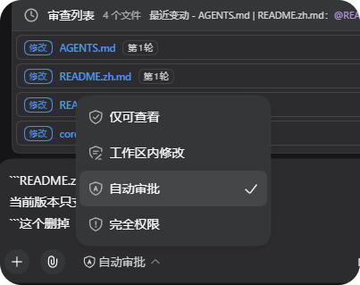
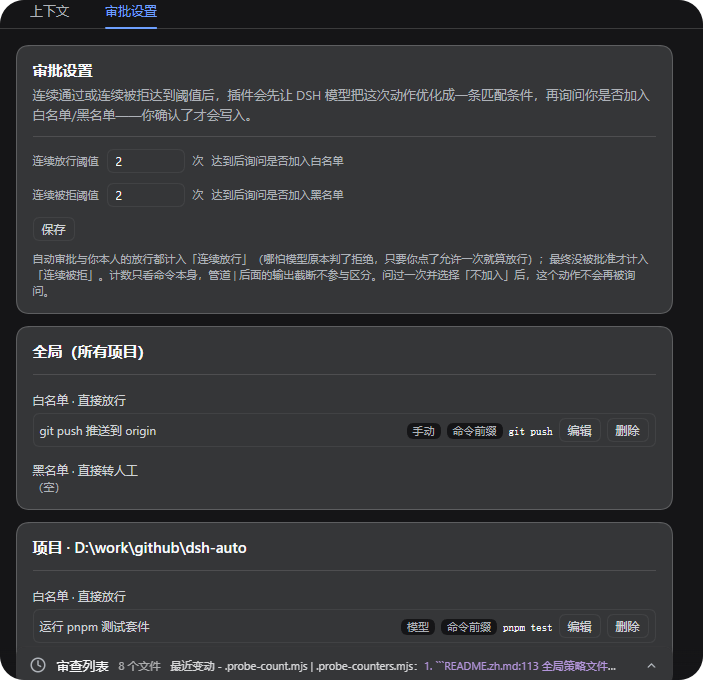
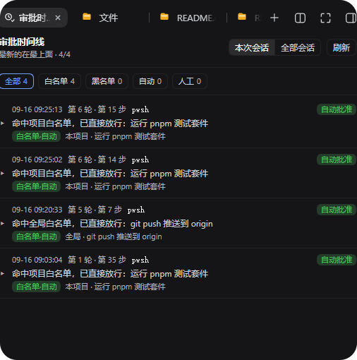
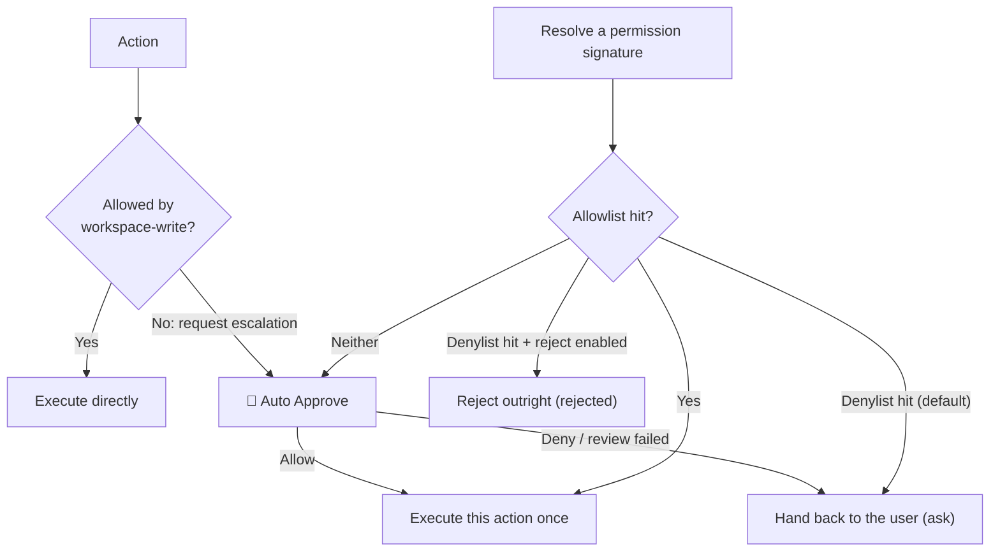

# dsh-auto-pass

English | [中文](README.zh.md)

> **This project only auto-approves the requests that pass review — it does not solve unattended operation.**
>
> This project is forked from / based on [simon300000/dsh-auto](https://github.com/simon300000/dsh-auto/).

`dsh-auto-pass` adds a `自动审批` (Auto Approve) permission preset to the DeepSeek Harness Web UI. Every action that needs approval goes through a **single-shot model review** — one plain model call, no child Agent, no tools and no transcript, fed only the normalized action plus your last direct message — and the plugin auto-approves only the requests that pass that review. A model denial, a host safety downgrade, and a failed review are all handed back to DSH's normal approval chain, so the user decides. The one exception is the **"Reject on denylist"** switch (off by default): once you turn it on, a denylist hit fails the tool call outright instead of opening an approval card.

On top of that sit two layers of *permission memory*: an **allowlist** (allowed directly from then on, with no model call) and a **denylist** (handed to you directly, with no model call), both at **project** and **global** scope. A rule comes from one of three places: your own promote/demote action in the timeline, the suggested rule the Reviewer returned with its review, or **the rule a threshold writes by itself** — after the same permission in the same project has been approved (default 3 times; auto-approvals and your own approvals both count) or denied (default 3 times; your own rejections count, and so does a model denial nobody overrode) in a row: the **approval** side writes the allowlist rule **automatically** (project scope when the session has a working directory, otherwise global) with no question card, while the **denial** side still asks you (this project / global / do not add). Either side uses the match condition the review already returned — or the action's **permission fingerprint** (the normalized signature, see below) when the review returned none. Answering "do not add" on the denylist stops the plugin from asking about that action again.

## Screenshots

Select the `自动审批` permission preset (DSH 0.1.5-rc.1):



The "Approval policy" panel — both thresholds plus the **global** and **project** allow/deny lists (conversation tab):



The "Approval timeline" panel — one row per decision, filterable by All / Allowlist / Denylist / Auto / Human (right sidebar):



## How it works



With `自动审批` selected, ordinary actions permitted by `workspace-write` run without any approval call. The diagram shows the sandbox-escalation path; other tool approval rules can also trigger Auto Approve. An approval request only exists when a tool actually asks for escalation (`sandbox_permissions` plus `justification`), so a call that never escalates never reaches the plugin.

- The plugin handles `approval/request` only when the session's current permission preset is `自动审批`; other presets continue through DSH's existing approval chain. The plugin registers its handler with `prepend`, so it answers before the Web UI's human-approval forwarder; that part does not depend on bundle order (the permission-preset override above still requires the bundle to be installed after `dsh-web-app`).
- Each review is **one plain model call**, and `timeoutMs` (90 s by default) covers that whole call including streaming. The Reviewer gets no child Agent, no tools, no file access and no session history, so it cannot investigate — it decides from what it is handed.
- The prompt is two JSON sections: the normalized action (tool name, command/paths, cwd, whether an escalation was requested) and minimal evidence (your last direct user message plus the most recent `ask_user_question` answer, each truncated to `maxEvidenceChars`, 400 by default). Only those two can establish authorization; nothing else is in the prompt at all.
- The review's stance is "**a harmless action does not need to interrupt you**": well-scoped, non-destructive, reversible and consistent with your request means allow. **Requesting an escalation (`sandbox_permissions`) is not by itself a reason to deny** — under the confined sandbox a test command needs it just to spawn a child process, so `pnpm test` with `danger-full-access` should still be allowed. What is always denied: deletion/overwrite, uploading or force-pushing, reading credentials or keys, sudo / changing the system or registry / a command that itself writes outside the workspace, code of unknown origin, and disabling security facilities.
- Only `outcome` is required in the reply, which must be a single line of JSON (an outer Markdown code fence is tolerated). A compact `{"outcome":"allow"}` defaults to low risk and unknown authorization; omitted fields on a denial default to high risk and unknown authorization. Explicit assessments may also contain `risk_level`, `user_authorization` and `rationale`, plus an optional `rule` suggestion. The plugin only ever downgrades, never upgrades: `critical` risk always becomes a denial, and so does `high` risk without at least `medium` user authorization. Invalid output, an unresolvable or over-long action, no review-model route to call, a timeout and any infrastructure failure are never turned into an automatic denial: they hand the request back to the user.
- A model denial is never turned into an automatic rejection: the plugin calls the next answerer, so the request continues through DSH's normal approval chain and the user decides. The plugin produces exactly two outcomes on its own: `allowed-once` for a review-passed request, and `rejected` when a denylist hit meets the opt-in "Reject on denylist" switch (off by default, so a denylist hit normally goes to the user as well). For a hand-off the review's opinion is also written into the approval request's `reason`, so the approval card itself shows why.
- **Lists take priority over the model review**: a denylist hit is handed to the user (or rejected outright when the switch is on) and an allowlist hit is allowed, both without calling the model. The denylist always beats the allowlist, and a project rule beats a global one. The one approval that matched a rule never counts towards the thresholds.
- A **permission fingerprint** is derived from the tool name plus normalized key arguments and is independent of call id and time: command tools use the command text (whitespace collapsed), file tools use path arguments, and everything else uses a key-sorted JSON of its arguments. Normalization removes only what does **not** change what is being authorized — a `description`/`justification` the model rewrites every time, everything after a pipe (`| Select-Object -Last 20`), a trailing output redirect such as `2>&1`, and differences in how the working directory is spelled. **Arguments that really do change the authorization, such as an escalation marker, are always kept**, so an escalated retry is not treated as an ordinary call and a different argument (another test file, say) is still a different permission. The fingerprint is what "similar permission" means here: it is the matching unit for list rules, the counting key for consecutive approvals, and the value the timeline's "add to list" form fills in by default (shown as **Permission fingerprint**, the `signature` match kind). **That value can only be looked at, never typed**: the plugin computes it, anything typed by hand is a rule that can never match, and other match kinds cannot be switched to it (a fingerprint can only be generated from a timeline record). What you get to read is a **rendering** of it rather than the machine string: the raw value is full of NUL separators, which a browser draws as little boxes, and **selecting that text and copying it loses the separators** (you paste `pwshcmd:pnpm testx:{…}`, a useless string) — so use the **Copy fingerprint** button next to it (it goes through the clipboard API and copies every character). Rule lists and forms show one compact line (`bash · npm test · sandbox_permissions=danger-full-access`), a record's detail shows three lines — tool / command (or arguments) / extra arguments — and the raw string lives in the tooltip.
- Those normalizations apply to **both counting and rule matching**: the same command with a different output truncation or a different description is one fingerprint (otherwise "three in a row" could never be reached), while a different argument or an added escalation is still a different permission — generalizing the key did not widen what it authorizes. Prefix conditions (command prefix / path prefix) additionally fold whitespace and ignore case.
- **Automatic promotion** counts consecutive approvals of the same action in one project (default 3, counting auto-approvals and your own "allow once" alike) and consecutive denials (default 3). The signal comes from the **final outcome**, not from the model verdict: a denial the review produced but you overrode on the approval card counts as an approval, and only an override-free denial counts against you. When the **approval** threshold is reached the rule goes into the allowlist **by itself** (project scope when the session has a working directory, otherwise global) — there is no question card on that side; the **denial** threshold still asks you (this project / global / do not add) and writes only after you confirm. With no usable model suggestion the plugin writes that action's **permission fingerprint** (so the same command with another output truncation still matches, instead of an exact signature that stops matching the moment you add `-Last 30`); switch the match kind to "command prefix" in the form when you want to cover other arguments of the same command. Declining on the denylist stops future counting and asking for that action.
- When the exact action cannot be resolved (for example the approval request arrives before its `tool/call` event, which also happens for PTC-dispatched tools) **no signature is created**. Such requests take part in neither list matching nor counting — otherwise they would all collapse into one empty signature and a few approvals would auto-approve every unresolvable call.
- The rejection-reason follow-up and the denylist threshold confirmation share one **serial queue**, so only one question card is ever on screen: the reason question first, the rule question after it. Both are side channels: they never change or delay the approval outcome, and the allowlist threshold writes its rule on such a side channel without any card at all.

The parent session records the approval events and a compact plugin notice (switchable off in the settings, on by default). The notice is injected **after** the approval settles, so it carries both the review verdict and the **final outcome**, for example `[auto] Auto Approve allowed bash · Matched: allowlist · low/medium · 0 steps · final result：approved · Rationale: ...` — a hand-off therefore shows whether you eventually approved or rejected it. The line is capped at 240 characters, and the review prompt, its suggested rules and the matched rule text never enter the context. If you explained a rejection, that reason arrives as a **second** one-line notice (`[human] rejection reason from the user：...`). Host logs record the route, risk, authorization, token usage and outcome of each review, but not full prompts or file contents; the token usage of each review is also stored on the record and shown in the timeline.

## Panels: approval policy and approval timeline

Every decision is recorded. The two panels are deliberately kept apart so the conversation area does not fill up with approval noise: **the conversation tab holds "Approval policy", the right sidebar holds the "Approval timeline"**. The panel data comes from the plugin's own localhost routes (`/api/dsh-auto-pass/log`, `/config`, `/policy`, `/rule`, `/rule/draft`, `/rule/revert`).

"Approval policy" contains the consecutive-approval and consecutive-denial thresholds (applied as soon as you save them, stored in the global section of the policy file) and the allow/deny lists at **global** and **project** scope (each rule shows its label, its source — manual/model/memory — and its match condition, and can be **edited** (change its label or match condition; the rule is updated in place, id kept) or deleted individually; the same rule never shows up twice: adding a rule with the same tool + match condition **updates** the existing one, a rule that an existing broader rule already covers **is not written again**, and a broader rule **merges away** the narrower rules it covers — the panel tells you which of the three happened). The settings card under Settings → Plugins (the same card also sits at the bottom of the "Approval policy" panel) holds the panel placement plus **four switches**: **inject approval results into the context** (off means the result line is no longer written into the model conversation; the timeline is unaffected), **reject on denylist**, **open the approval timeline automatically** (any approval arriving while the timeline is not on screen reveals it; it never steals focus when the timeline is already showing, and a page reload does not pop it open for older records), and **ask for a reason after a rejection** (the first option is that review's model note, one click away; you can also type your own or pick "No comment"). All of them live in the DSH settings namespace `dsh-auto-pass`, apply immediately, and survive restarts. Managing project rules requires knowing the current project directory: the plugin first asks the host's session list and otherwise falls back to the `cwd` of the newest approval record in this session.

The "Approval timeline" has **quick filters** at the top — five chips (`All` / `Allowlist` / `Denylist` / `Auto` / `Human`), each carrying the number of records in this session (the panel only looks at the current session; the this-session/all-sessions switch was removed in 2026-09-18, while the records keep their session fields); allowlist and denylist look at whether the approval matched a list rule, auto at what the plugin approved by itself, and human at what you decided — the latter two exclude list hits, so **the four never overlap and their counts add up to the total**; the four **stack** (with several lit, a record matching any of them is shown), while `All` clears the selection. The list is **grouped by day** (today / yesterday / MM-DD) and every record sits on a timeline rail — a vertical line plus a dot tinted by the outcome (green = approved automatically, amber = waiting for you or rejected outright, gray = you already decided). A collapsed row head is **two lines**: the first is `hh:mm:ss · tool · source chip · auto-add badge · verdict badge`, the second the review opinion, so you can tell why a request was allowed or handed to you without expanding it; expanding one starts with a **verdict callout** (`allowed automatically · low risk` / `handed to you · critical risk`, success or warning tint) carrying risk, authorization, the matched rule and the consecutive counts as chips, followed by a **"Basis"** block (the review rationale, the approval reason, the rejection reason you gave) and a **rule card** for the rule this approval wrote — with its undo button; every technical field sits in a **collapsed "Debug info" section** at the bottom, split into `This action` (permission fingerprint — one click to copy the raw string —, command, extra args, action JSON, turn/step) and `Review & usage` (suggested rule, decided-by, review model, token usage, latency, time); duplicate or permanently empty rows are gone (the tool row merged into the fingerprint row, the signature summary just repeated tool + command, `Auto-promoted` never happens on new records, and the reviewer step count is always 0 in a single-shot review); the detail ends with two **collapsible cards whose header is the toggle** (click the title to expand / collapse): **"Add to a list"** (form collapsed by default) and **"Debug info"**. The add form has three rows with visible labels (match kind / match value / rule label), one **Scope** pick (this project / global) plus two action buttons — **"Allow it from now on"** and **"Hand it to me from now on"** — sharing that scope; a record that **auto-added an allowlist rule** at the threshold carries a short badge on the first line — `+allowlist` (hover it to see where the condition came from — `model suggestion` for the rule the review model handed back, `fingerprint` when it fell back to this action's permission fingerprint — plus the scope and rule label; when an existing rule already covered the action the badge reads `allowlist covered` instead); a match condition is a command prefix, an exact signature, or a path prefix (the kinds this action cannot use are disabled, so no rule that can never match gets written) — a path prefix takes a **single-segment** wildcard (`D:/work/x/src/*.js`, files directly in that directory), while a cross-directory `**` is refused; expanding a record lets you **promote it to the allowlist** or **demote it to the denylist**, at "this project" or "global" scope. The rule to add is prefilled with the **suggested rule** the Reviewer produced for that review (model-authored, and able to cover a class of actions such as `command_prefix: pnpm test`), or with the action's **exact signature** when the record has no usable suggestion (for example the review did not finish, or the model's "exact signature" does not match this action) — the narrowest option, and the very value the detail shows as **Signature**; **that form is editable** — match kind (command prefix / exact signature / path prefix), match value and label are yours, and the four buttons add exactly what you wrote, with no model in the loop. Switching the match kind asks the host to regenerate that value for the new kind with one extra model call (`/rule/draft`), falling back to a locally derived value; the same call can be used to fill in the value before you commit. A suggestion that plainly does not cover the reviewed action (the model has written things like `danger-full-access` as an "exact signature") is dropped — it is not used as the form's default either — and the exact signature is used instead. **Rules that get displaced are named, and the add can be undone**: when the rule you add covers narrower ones you confirmed earlier (a command prefix covering the exact signature of one action, say), the plugin deletes those narrower rules — one list never holds two rules that cover each other — and names them in the result, the record and the host log; that record's detail then offers **Undo this add**, which removes the rule this add wrote and puts the displaced ones back exactly as they were (it refuses, and says why, once the add was already undone or the rule has been changed since). A rule the approval threshold wrote by itself carries the same undo entry, and the detail marks it as auto-added (no prompt). Editing a rule in the policy panel also names the narrower rules it merged away, but that path has no undo.

- Placement follows [`dsh-context`](https://github.com/bowenliang123/dsh-context)'s model: a tab beside Chat/Trajectory in the conversation view (`conversation.view`) holds the policy panel and a right-sidebar tab (`sidebarRightTabs`) holds the timeline, or both. `placement: all` (default) registers both, so the conversation tab is visible at once; `auto` prefers the right sidebar and falls back to the conversation tab when the sidebar seat is unavailable — so the panels also work without any third-party sidebar plugin. Use `tab` or `sidebar` to keep just one.
- A settings card (`settings.plugin.item`, under Settings → Plugins) switches the placement at runtime; the choice is written to the DSH settings namespace `dsh-auto-pass`, survives restarts, and overrides the `placement` config value. Note that Settings only renders cards for plugins that registered a settings namespace host-side, so the host half registers one (the client card's key must equal that namespace).
- A collapsed row shows the time (clock only; the day comes from the group header), tool name, the source chip (matched list + decided-by; hover for the matched rule name), the verdict (`auto-approved` / `handed to user` / `rejected outright` / `review incomplete`) and the outcome badge, with the review opinion on the second line; the turn/step lives in the detail's debug section. Expanding it starts with a **verdict callout** (conclusion + risk/authorization/matched-rule/consecutive-count chips), then a **Basis** block (review rationale, approval reason, the rejection reason you gave) and the **rule card** for what this approval wrote (with its undo button); the technical fields live in the collapsed **"Debug info"** card at the bottom, in two groups — `This action`: the **signature** (the exact string the form writes into a list, with a copy button), command, extra args, action arguments (truncated to 500 characters), turn and step; `Review & usage`: suggested rule, decided-by, the review model, token usage, latency and time. The **"Add to a list"** card (collapsed by default) holds the form, which gives every row a visible label, one Scope pick and two action buttons. The panel only shows the current session (the all-sessions view was removed; records keep their session fields).
- Records persist as JSON, survive restarts, and are **split per workspace**: `$DSH_HOME/dsh-auto-pass/records/<workspace>.json` (default `~/.dsh/dsh-auto-pass/records/`; records without a cwd go to `unknown.json`), newest 1000 kept per workspace and written atomically, while the panels read all workspaces merged into one timeline. Upgrading splits the old single `$DSH_HOME/dsh-auto-pass/approvals.json` per workspace (the original is deleted only after every write succeeded; duplicate ids are collapsed). Setting `logFile` explicitly falls back to single-file mode; `maxRecords` caps each workspace. The log stores local approval data only and is served on localhost.
- Policy and counters live in three kinds of files: the global policy `$DSH_HOME/dsh-auto-pass/policy.json` (thresholds + global lists), the project policy `<session cwd>/.dsh-auto-pass/policy.json` (project lists), and the **per-workspace** counters `$DSH_HOME/dsh-auto-pass/counters/<workspace>.json` (same slug scheme as the approval records; records without a cwd go to `unknown.json`). A project directory therefore gains a `.dsh-auto-pass/` directory only once you actually write a project rule for it (that directory is in this repository's `.gitignore`; consider ignoring it in yours too). Each counter file is **capped at 500 entries** (a counter key embeds the arguments JSON, so it would otherwise grow forever): past the cap the least recently used active entries go first and `dismissed` entries last, while entries with both sides at zero that were never dismissed are dropped at startup; an approval rewrites only its own workspace file, never the global policy file. A failed write only warns: a project rule that cannot be written degrades to a global rule, and policy I/O never changes an approval outcome.

## Install

The package name is `dsh-auto-pass`, and the bundle must be installed after `dsh-web-app`. Install it from GitHub:

```sh
dsh plugin --profile web add github:sujingkpo/dsh-auto-pass
```

or from a local checkout:

```sh
dsh plugin --profile web add link:/path/to/dsh-auto-pass
```

Restart the Web UI, then pick `自动审批` in the session Permissions selector or as the default permission preset in General Settings. The preset runs in the `workspace-write` sandbox and keeps `approval: ask`: the plugin answers inside DSH's approval waterfall rather than replacing it.

## Configuration

Below are the keys from the bundled `cordis.patch.yml` that belong in a config file; every key except the reviewer pair is optional, and the values shown are the plugin's defaults. The remaining preferences are changed in the UI (see the end of this section).

```yaml
- id: dsh-auto-pass
  name: dsh-auto-pass
  config:
    language: auto
    reviewerProvider: deepseek-official
    reviewerModel: deepseek-v4-flash
    reviewerReasoningEffort: high
    timeoutMs: 90000
    maxEvidenceChars: 400
    maxActionChars: 16000
    maxOutputTokens: 2048
    logFile: ''
    maxRecords: 1000
    policyFile: ''
```

### Key reference

- `language` — the language of the review: `auto` (default) counts Han characters in the messages **you** send (four or more selects Chinese, otherwise English; agent instructions, assistant messages and tool results do not count), or pin it with `zh` / `en`. An invalid value only warns and falls back to `auto`. The security policy text is one Chinese prompt in both modes, so translation never changes review semantics.
- `reviewerProvider` / `reviewerModel` — which provider and model run the review; they **must be set together**. With both omitted the Reviewer uses the parent session's current provider and model, and a review with no route at all is handed to the user.
- `reviewerReasoningEffort` — the reasoning effort handed to the review model (for example `high`); it must be a **non-empty string**, and leaving it out uses the model's own default.
- `timeoutMs` — the deadline for one review in milliseconds (90000 by default), covering that single model call including streaming; a timeout hands the request to the user.
- `maxEvidenceChars` — how much evidence is kept (your last direct message and the most recent `ask_user_question` answer), **each** truncated to this many characters, 400 by default.
- `maxActionChars` — the character cap on the normalized action JSON (16000 by default); a longer action is handed to the user **without calling the model**.
- `maxOutputTokens` — the token cap on the review reply (2048 by default).
- `logFile` — the approval-record file; **empty** means one file per workspace (`$DSH_HOME/dsh-auto-pass/records/<workspace>.json`), while an explicit path falls back to single-file mode (every workspace in one file, useful for debugging).
- `maxRecords` — how many records are kept **per workspace**, 1000 by default.
- `policyFile` — the global policy file (**thresholds and global lists only**); empty means `$DSH_HOME/dsh-auto-pass/policy.json`. Consecutive counters live elsewhere, **one file per workspace** (`$DSH_HOME/dsh-auto-pass/counters/<workspace>.json`, same slug scheme as the approval records; no cwd means `unknown.json`). Each counter file holds **at most 500** entries: past the cap the least recently used active entries are evicted first and `dismissed` entries last, while entries with both sides at zero that were never dismissed are dropped at startup. Upgrading splits the `cwd`-prefixed counters of an older global file into those files, removing them from the global file only after every write succeeded.

Numeric keys must be **positive integers** and `logFile` / `policyFile` must be strings — a wrong type fails plugin load outright, and setting only one of `reviewerProvider` / `reviewerModel` does too.

A few more keys **belong in the UI**: `placement`, `notice`, `denyDirect`, `autoOpenTimeline`, `askRejectReason` (the four behaviour switches) and `autoApproveAfter` / `autoDenyAfter` (the default consecutive-approval / consecutive-denial thresholds). They do not have to be written into a config file; when they are, **the settings value still wins**, and a threshold changed in the panel is stored in the policy file.

`notice` (default `true`) controls whether the approval result line is injected into the model context; `denyDirect` (default `false`) controls whether a denylist hit rejects the call outright; `autoOpenTimeline` (default `true`) controls whether an approval expands the timeline automatically while the right sidebar is collapsed (it stays put when the timeline is already on screen or the sidebar is showing another tool); `askRejectReason` (default `true`) controls whether rejecting an approval asks you for a reason (the first option is that review's model note, one click away; you can also type your own or pick "No comment"), and the reason you give is injected as its own line even when `notice` is off — the two switches are independent. All four can be changed from the settings card or the "Approval policy" panel, and the settings value wins over these defaults. Because they are read on every approval, a change applies immediately with no restart.

A profile override replaces the complete matching bundle-row `config`, so repeat every value that should remain configured.

The Reviewer's system prompt is `prompts/review.md` and the match-condition prompt used for rule suggestions is `prompts/rule.md`; both are plain Markdown, read when the plugin loads. Restart DSH after changing the configuration, policy, or plugin code.

## License

[MIT](LICENSE)
