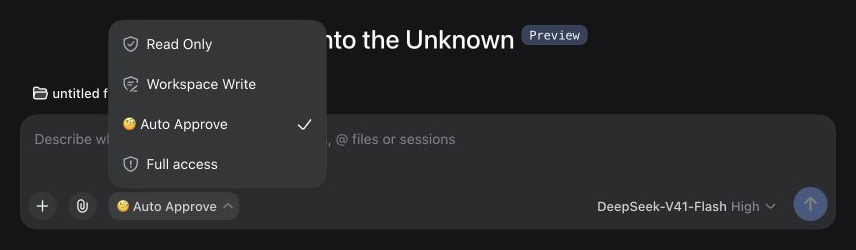
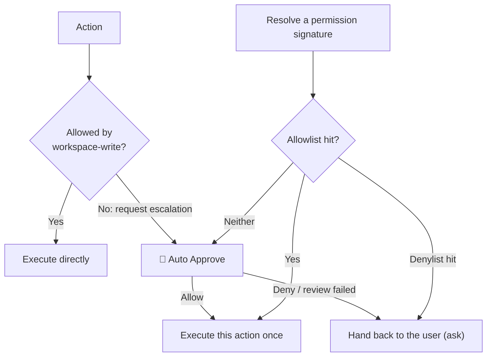

# dsh-auto-pass

English | [中文](README.zh.md)

`dsh-auto-pass` adds a `自动审批` (Auto Approve) permission preset to the DeepSeek Harness Web UI. Each action that requires approval is reviewed by a fresh, restricted DSH child Agent, and the plugin only auto-approves the requests that pass that review. A model denial, a host safety downgrade, and a failed review are all handed back to DSH's normal approval chain, so the user decides — the plugin never denies on the user's behalf.

On top of that sit two layers of *permission memory*: an **allowlist** (allowed directly from then on, with no model call) and a **denylist** (handed to you directly, with no model call), both at **project** and **global** scope. A rule comes from one of three places: your own promote/demote action in the timeline, the suggested rule the Reviewer returned with its review, or **the confirmation prompt that follows a threshold** — after the same permission in the same project has been approved (default 3 times; auto-approvals and your own approvals both count) or denied (default 3 times; model denials and your own rejections both count) in a row, the plugin **first has the DSH model turn the action into a match condition** and then asks whether to add it to the allowlist/denylist (this project / global / do not add). Nothing is written until you confirm, and answering "do not add" stops the plugin from asking about that action again.

The current release supports the Web UI only.

## Screenshots

Select the `自动审批` permission preset (DSH 0.1.5-rc.1, English UI):



The Reviewer allows a bounded read-only action:


## How it works



With `Auto Approve` selected, ordinary actions permitted by `workspace-write` run without a Reviewer call. The diagram shows the sandbox-escalation path; other tool approval rules can also trigger Auto Approve.

- The plugin handles `approval/request` only when the session selects `Auto Approve`. Other permission presets continue through DSH's existing approval chain.
- Each approval starts one `spawn` Reviewer session. DSH's own agent loop handles any bounded `read`, `glob`, or `grep` investigation and captures the final structured result; the plugin does not implement a separate model/tool loop.
- The child is created with a read-only sandbox and `approval/policy = never`. An execution guard denies every tool except `read`, `glob`, `grep`, and the scoped structured-output tool, permits no further subagents, and allows at most four investigation steps plus the final response step. Sensitive files may be inspected only when a minimal read-only check can change the decision.
- The Reviewer receives the exact pending action, approval reason, current permissions, bounded raw session events, the main Agent's assembled system instructions, and AGENTS.md or equivalent workspace instructions. Stable instructions are serialized in a separate cacheable prefix before session identifiers, transcripts, permissions, and action data. Direct user messages, human answers returned by `ask_user_question`, assembled system instructions, and workspace instructions can establish authorization; assistant content and other tool results remain untrusted evidence.
- Only `outcome` is required in the structured result. A compact `{"outcome":"allow"}` defaults to low risk and unknown authorization; omitted fields on a denial default to high risk and unknown authorization. Explicit assessments may also contain `risk_level`, `user_authorization`, and `rationale`. The host always denies critical risk and denies high risk without at least medium user authorization. Invalid output, missing action data, timeout, cancellation-independent infrastructure failure, and tool failure are never turned into an automatic denial: they hand the request back to the user.
- A model denial is not re-reviewed and is never turned into an automatic rejection: the plugin calls the next answerer, so the request continues through DSH's normal approval chain and the user decides. `allowed-once` is the only outcome the plugin ever produces on its own.
- **Lists take priority over the model review**: a denylist hit is handed to the user and an allowlist hit is allowed, both without starting a Reviewer (no model spend). The denylist always beats the allowlist, and a project rule beats a global one.
- A **permission signature** is derived from the tool name plus normalized key arguments and is independent of call id and time: command tools use the command text (whitespace collapsed), file tools use path arguments, and everything else uses a key-sorted JSON of its arguments. Extra arguments such as an escalation marker are part of the signature, so an escalated retry is not treated as an ordinary call. The signature is what "similar permission" actually means here.
- **Automatic promotion** counts only approvals you made yourself: approvals the plugin granted are excluded, and so are manual approvals of an action that matched a list rule. After the signature has been approved manually that many times in a row within one project (default 3, editable in the panel), the plugin writes an **exact-signature** memory rule and resets the counter; a single rejection resets the streak immediately.
- When the exact action cannot be resolved (for example the approval request arrives before its `tool/call` event) **no signature is created**. Such requests take part in neither list matching nor counting — otherwise they would all collapse into one empty signature and a few approvals would auto-approve every unresolvable call.
- The default 90-second deadline covers child creation, all model steps, local read-only investigation, and final structured output. Each approval is still isolated in its own child session.

The parent session records the approval events and a compact plugin notice: an auto-approved action gets the `allowed` notice, and a request handed back to the user gets a notice that names the Reviewer's rationale for not approving it. The Reviewer child session uses an `_auto-approve:<callId>` label and contains its messages, investigation tool calls and results, final assessment, and turn end. Console logs contain identifiers, model route, step count, stop reason, risk, authorization, and outcome, but not full prompts or file contents.

## Panels: approval policy and approval timeline

Every decision is recorded. The two panels are deliberately kept apart so the conversation area does not fill up with approval noise: **the conversation tab holds "Approval policy", the right sidebar holds the "Approval timeline"**. The host serves data from `/api/dsh-auto-pass/log`, `/policy`, and `/rule`, and the plugin's client half renders it.

"Approval policy" contains the consecutive-approval threshold (applied as soon as you save it, stored in the global section of the policy file), the panel placement, and the allow/deny lists at **global** and **project** scope (each rule shows its label, its source — manual/model/memory — and its match condition, and can be deleted individually). Managing project rules requires knowing the current project directory: the plugin first asks the host's session list and otherwise falls back to the `cwd` of the newest approval record in this session.

In the "Approval timeline", every row already shows the **review opinion** and the **matched list** (allowlist/denylist + scope + rule label), so you can tell why a request was allowed or handed to you without expanding it; expanding a record lets you **promote it to the allowlist** or **demote it to the denylist**, at "this project" or "global" scope. The rule text prefers the **suggested rule** the Reviewer produced for that review (model-authored, and able to cover a class of actions such as `command_prefix: pnpm test`); when the record has no suggestion (for example the review did not finish and the request was handed to you), it falls back to the exact signature of that action — narrower is better than broader.

- Placement follows [`dsh-context`](https://github.com/bowenliang123/dsh-context)'s model: a tab beside Chat/Trajectory in the conversation view (`conversation.view`) holds the policy panel and a right-sidebar tab (`sidebarRightTabs`) holds the timeline, or both. `placement: all` (default) registers both, so the conversation tab is visible at once; `auto` prefers the right sidebar and falls back to the conversation tab when the sidebar seat is unavailable — so the panels also work without any third-party sidebar plugin. Use `tab` or `sidebar` to keep just one.
- A settings card (`settings.plugin.item`, under Settings → Plugins) switches the placement at runtime; the choice is written to the DSH settings namespace `dsh-auto-pass`, survives restarts, and overrides the `placement` config value. Note that Settings only renders cards for plugins that registered a settings namespace host-side, so the host half registers one (the client card's key must equal that namespace).
- Each row shows time, tool name, the verdict (`auto-approved` / `handed to user` / `review incomplete`), a review-opinion excerpt, and the matched allowlist/denylist rule when one matched, plus how you answered for a hand-off; expanding it shows risk level, user authorization, rationale, approval reason, action arguments (truncated to 500 characters), latency, reviewer session, and step count.
- Records persist as JSON and survive restarts: `$DSH_HOME/dsh-auto-pass/approvals.json` (default `~/.dsh/dsh-auto-pass/approvals.json`), newest 1000 kept, written atomically. `logFile` moves the file; `maxRecords` changes the cap. The log stores local approval data only and is served on localhost.
- Policy lives in two files: global `$DSH_HOME/dsh-auto-pass/policy.json` (threshold, global lists, consecutive counters) and project `<session cwd>/.dsh-auto-pass/policy.json` (project lists). Counters always live in the global file and are keyed by `cwd`, so a project directory gains a `.dsh-auto-pass/` directory only once you actually write a project rule for it (that directory is in this repository's `.gitignore`; consider ignoring it in yours too). A failed write only warns: a project rule that cannot be written degrades to a global rule, and policy I/O never changes an approval outcome.

## Install

The package name is `dsh-auto-pass`. Install it from GitHub:

```sh
dsh plugin --profile web add github:sujingkpo/dsh-auto-pass
```

or from a local checkout:

```sh
dsh plugin --profile web add link:/path/to/dsh-auto-pass
```

Restart the Web UI, then select `Auto Approve` in the session Permissions selector or as the default permission preset in General Settings.

## Configuration

The bundled defaults use `deepseek-official/deepseek-v4-flash` with `high` reasoning:

```yaml
- id: dsh-auto-pass
  name: dsh-auto-pass
  config:
    language: auto
    reviewerProvider: deepseek-official
    reviewerModel: deepseek-v4-flash
    reviewerReasoningEffort: high
    timeoutMs: 90000
    maxInvestigationSteps: 4
    maxMessageTranscriptTokens: 4000
    maxToolTranscriptTokens: 3000
    maxMessageEntryTokens: 1000
    maxToolEntryTokens: 512
    maxSystemInstructionTokens: 6000
    maxAgentInstructionTokens: 6000
    maxRecentNonUserEntries: 20
    maxActionChars: 16000
    maxOutputTokens: 8192
    maxRecords: 1000
    placement: all
    autoApproveAfter: 3
    policyFile: ''
```

`language` accepts `auto` (default), `zh`, or `en`. An invalid value emits a warning and falls back to `auto`. In `auto` mode, the plugin counts Han characters across direct user messages in the session: four or more selects Chinese; otherwise it selects English. Agent instructions, assistant messages, and tool results do not affect detection. The Reviewer is instructed to write its rationale in the language of the direct user prompt. The security policy itself remains in Chinese in both modes to avoid changing review semantics through translation.

`reviewerProvider` and `reviewerModel` must be set together. If both are omitted, the Reviewer uses the parent session's current provider and model. `autoApproveAfter` is the **default** for the consecutive-approval threshold; a value changed in the panel is stored in the policy file and takes priority over it (it must be at least 1). `policyFile` moves the global policy file; leave it empty to use the default path.

A profile override replaces the complete matching bundle-row `config`, so repeat every value that should remain configured.

The Reviewer persona and the additional security rules live in `prompts/policy-template.md` and `prompts/policy.md`. Restart DSH after changing the configuration, policy, or plugin code.

## License

[MIT](LICENSE)
