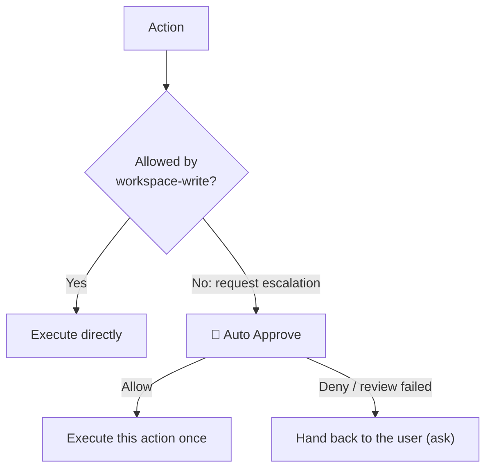

# dsh-auto-pass

English | [中文](README.zh.md)

`dsh-auto-pass` adds a `🚦 Auto Approve` permission preset to the DeepSeek Harness Web UI. Each action that requires approval is reviewed by a fresh, restricted DSH child Agent, and the plugin only auto-approves the requests that pass that review. A model denial, a host safety downgrade, and a failed review are all handed back to DSH's normal approval chain, so the user decides — the plugin never denies on the user's behalf.

The current release supports the Web UI only.

## Screenshots

Select the `🚦 Auto Approve` permission preset (DSH 0.1.5-rc.1, English UI):


The Reviewer allows a bounded read-only action:


## How it works



With `Auto Approve` selected, ordinary actions permitted by `workspace-write` run without a Reviewer call. The diagram shows the sandbox-escalation path; other tool approval rules can also trigger Auto Approve.

- The plugin handles `approval/request` only when the session selects `Auto Approve`. Other permission presets continue through DSH's existing approval chain.
- Each approval starts one `spawn` Reviewer session. DSH's own agent loop handles any bounded `read`, `glob`, or `grep` investigation and captures the final structured result; the plugin does not implement a separate model/tool loop.
- The child is created with a read-only sandbox and `approval/policy = never`. An execution guard denies every tool except `read`, `glob`, `grep`, and the scoped structured-output tool, permits no further subagents, and allows at most four investigation steps plus the final response step. Sensitive files may be inspected only when a minimal read-only check can change the decision.
- The Reviewer receives the exact pending action, approval reason, current permissions, bounded raw session events, the main Agent's assembled system instructions, and AGENTS.md or equivalent workspace instructions. Stable instructions are serialized in a separate cacheable prefix before session identifiers, transcripts, permissions, and action data. Direct user messages, human answers returned by `ask_user_question`, assembled system instructions, and workspace instructions can establish authorization; assistant content and other tool results remain untrusted evidence.
- Only `outcome` is required in the structured result. A compact `{"outcome":"allow"}` defaults to low risk and unknown authorization; omitted fields on a denial default to high risk and unknown authorization. Explicit assessments may also contain `risk_level`, `user_authorization`, and `rationale`. The host always denies critical risk and denies high risk without at least medium user authorization. Invalid output, missing action data, timeout, cancellation-independent infrastructure failure, and tool failure are never turned into an automatic denial: they hand the request back to the user.
- A model denial is not re-reviewed and is never turned into an automatic rejection: the plugin calls the next answerer, so the request continues through DSH's normal approval chain and the user decides. `allowed-once` is the only outcome the plugin ever produces on its own.
- The default 90-second deadline covers child creation, all model steps, local read-only investigation, and final structured output. Each approval is still isolated in its own child session.

The parent session records the approval events and a compact plugin notice: an auto-approved action gets the `allowed` notice, and a request handed back to the user gets a notice that names the Reviewer's rationale for not approving it. The Reviewer child session uses an `_auto-approve:<callId>` label and contains its messages, investigation tool calls and results, final assessment, and turn end. Console logs contain identifiers, model route, step count, stop reason, risk, authorization, and outcome, but not full prompts or file contents.

## Approval log panel

Every decision is recorded and shown as a reverse-chronological timeline. The host serves the records from `/api/dsh-auto-pass/log` and the plugin's client half renders them.

- Placement follows [`dsh-context`](https://github.com/bowenliang123/dsh-context)'s model: a tab beside Chat/Trajectory in the conversation view (`conversation.view`), a tab in the right sidebar (`sidebarRightTabs`), or both. `placement: auto` (default) prefers the right sidebar and falls back to the conversation tab when the sidebar seat is unavailable — so the panel also works without any third-party sidebar plugin.
- A settings card (`settings.plugin.item`) switches the placement at runtime; the choice lives in `localStorage` and overrides the `placement` config value.
- Each row shows time, tool name, the verdict (`auto-approved` / `handed to user` / `review incomplete`) and, for a hand-off, how you answered; expanding it shows risk level, user authorization, rationale, approval reason, action arguments (truncated to 500 characters), latency, reviewer session, and step count.
- Records persist as JSON and survive restarts: `$DSH_HOME/dsh-auto-pass/approvals.json` (default `~/.dsh/dsh-auto-pass/approvals.json`), newest 1000 kept, written atomically. `logFile` moves the file; `maxRecords` changes the cap. The log stores local approval data only and is served on localhost.

## Install

The package name is `dsh-auto-pass`. Install it from GitHub:

```sh
dsh plugin --profile web add github:sujingkpo/dsh-auto-pass
```

or from a local checkout:

```sh
dsh plugin --profile web add link:/path/to/dsh-auto-pass
```

Restart the Web UI, then select `Auto Approve` in the session Permissions selector or as the default permission preset in General Settings.

## Configuration

The bundled defaults use `deepseek-official/deepseek-v4-flash` with `high` reasoning:

```yaml
- id: dsh-auto-pass
  name: dsh-auto-pass
  config:
    language: auto
    reviewerProvider: deepseek-official
    reviewerModel: deepseek-v4-flash
    reviewerReasoningEffort: high
    timeoutMs: 90000
    maxInvestigationSteps: 4
    maxMessageTranscriptTokens: 4000
    maxToolTranscriptTokens: 3000
    maxMessageEntryTokens: 1000
    maxToolEntryTokens: 512
    maxSystemInstructionTokens: 6000
    maxAgentInstructionTokens: 6000
    maxRecentNonUserEntries: 20
    maxActionChars: 16000
    maxOutputTokens: 8192
    maxRecords: 1000
    placement: auto
```

`language` accepts `auto` (default), `zh`, or `en`. An invalid value emits a warning and falls back to `auto`. In `auto` mode, the plugin counts Han characters across direct user messages in the session: four or more selects Chinese; otherwise it selects English. Agent instructions, assistant messages, and tool results do not affect detection. The Reviewer is instructed to write its rationale in the language of the direct user prompt. The security policy itself remains in Chinese in both modes to avoid changing review semantics through translation.

`reviewerProvider` and `reviewerModel` must be set together. If both are omitted, the Reviewer uses the parent session's current provider and model. A profile override replaces the complete matching bundle-row `config`, so repeat every value that should remain configured.

The Reviewer persona and the additional security rules live in `prompts/policy-template.md` and `prompts/policy.md`. Restart DSH after changing the configuration, policy, or plugin code.

## License

[MIT](LICENSE)
