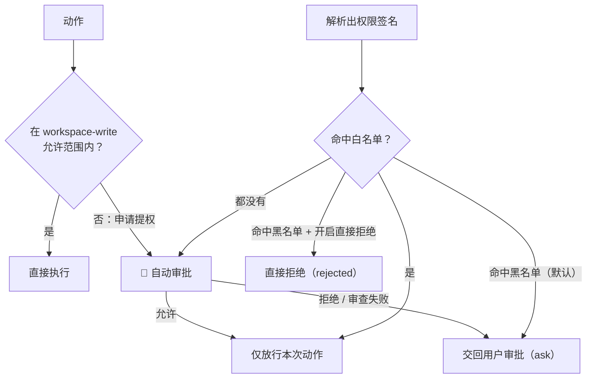

# dsh-auto-pass

[English](README.md) | 中文

> **本项目只解决「自动审批通过」，不解决无人值守问题。**
>
> 本项目 fork / 参考自 [simon300000/dsh-auto](https://github.com/simon300000/dsh-auto/)。

`dsh-auto-pass` 为 DeepSeek Harness 的 WebUI 增加 `自动审批` 权限档位。每个需要审批的动作都会先交给一次**单轮模型审查**——一次普通的模型调用，不起子代理、不带工具、没有会话转录，只喂归一化后的动作与你最后一条直接消息——插件只自动放行审查通过（allow）的请求。模型拒绝、宿主安全降级和审查失败一律交回 DSH 原生人工审批链，由用户决定。**唯一的例外是设置里显式打开的「黑名单直接拒绝」**（默认关闭）：打开后命中黑名单的调用直接判为拒绝、不弹审批卡。

在此之上还有两层「权限记忆」：**白名单**（以后直接放行，不再叫模型）与**黑名单**（以后直接转人工，不再叫模型），白/黑名单分**项目**与**全局**两级。规则来源有三种：你在时间线上手动升级/降级、审查模型在审查时顺带给出的建议规则，以及**连续通过/连续被拒达到阈值后的确认询问**——同一个项目下同一权限连续放行（默认 3 次，插件自动放行与你本人的放行都算）或连续被拒（默认 3 次，你的手动拒绝算，无人推翻的模型拒绝也算）达到阈值时，插件会问你是否加入白名单/黑名单（本项目 / 全局 / 不加入）：优先用本次审查回复里顺带的建议条件，没有可用建议就**默认写成命令前缀**（例如 `pnpm test`；没有命令的动作才回落到精确签名）。**只有你确认才会写入**；选「不加入」后这个动作不会再被计数、也不会再被询问。

## 截图

选择 `自动审批` 权限档位（DSH 0.1.5-rc.1，中文界面）：


「审批设置」面板——连续放行 / 连续被拒两个阈值，以及**全局**与**项目**两级的白名单、黑名单（对话区标签页）：


「审批时间线」面板——每次审批一条记录，顶部可按 全部 / 白名单 / 黑名单 / 自动 / 人工 筛选（右侧栏）：


## 工作方式



选择 `自动审批` 后，`workspace-write` 允许范围内的普通操作直接执行，不需要任何审批。图中展示的是沙箱提权流程；其他工具审批规则也可能触发自动审批。**审批请求只在工具真的申请提权时才会产生**（`sandbox_permissions` + `justification`），所以从不提权的调用根本到不了插件。

- 只有会话**当前**权限档位是 `自动审批` 时，插件才接管这次审批请求；其他权限档位继续使用 DSH 原有审批链。插件抢在人工审批应答器之前接管，因此不依赖 bundles 顺序（上面那张权限预设表的覆盖仍然要求本 bundle 装在 `dsh-web-app` 之后）。
- 每次审查就是**一次普通的模型调用**，`timeoutMs`（默认 90 秒）覆盖这一次调用（含流式读取）。审查模型没有子 Agent、没有工具、读不了文件，也看不到会话历史，所以它无从调查，只能凭给到的信息判断。
- 提示词是两段 JSON：① 归一化后的动作（工具名、命令/路径、cwd、是否申请提权）；② 极简证据（你最后一条**直接**用户消息 + 最近一次 `ask_user_question` 的回答，各自截断到 `maxEvidenceChars`，默认 400 字）。只有这两者能构成授权；其余东西根本不在提示词里。
- 回复只强制要求 `outcome`，且必须是**一行 JSON**（外面包一层 Markdown 代码围栏也能容忍）。简写 `{"outcome":"allow"}` 默认表示 low 风险、unknown 授权；deny 缺少其他字段时默认表示 high 风险、unknown 授权。完整结果还可以包含 `risk_level`、`user_authorization`、`rationale`，以及可选的 `rule` 建议。插件**只会降级、绝不升级**：critical 风险一定变成拒绝，用户授权低于 medium 的 high 风险也一定变成拒绝。输出不合法、动作拿不到或过长、没有可用的审查模型路由、超时以及任何基础设施失败，都**不会**变成自动拒绝，而是把请求交回用户。
- 模型拒绝不会被重新审查，也**不会**变成自动拒绝：插件调用下一个审批应答器，让请求继续走 DSH 原生审批链，由用户决定。插件自动给出的结论只有两种：审查通过时的 `allowed-once`，以及**设置里打开「黑名单直接拒绝」后**命中黑名单时的 `rejected`（默认关闭 = 黑名单也只转人工）。转人工时审查意见还会写进审批请求的 `reason`，审批卡首行就能看到为什么转人工。
- **名单优先于模型审查**：命中黑名单直接转人工（开了直接拒绝则是直接判拒）、命中白名单直接放行，两者都不调用模型。黑名单永远压过白名单；项目级规则优先于全局级。命中名单的那一次按设计**不参与计数**。
- **权限签名**由「工具名 + 归一化关键参数」得出，与调用 id、时间无关：命令类工具取命令文本（折叠空白），文件类工具取路径参数，其余取按键排序的参数 JSON；提权标记等额外参数也进签名，所以「提权重试」不会被当成普通调用。签名既是「相似权限」的判定单位，也是时间线上手动升级/降级发给插件的匹配单位。
- **连续计数的键是签名的「忽略展示差异」变体**：审查提示词里的 `description`/`justification`、管道之后的部分（`| Select-Object -Last 20`）以及结尾的输出重定向（`2>&1`）都不进计数键——模型每次都会改写这些，逐字比对永远攒不到阈值。**规则匹配本身没有放宽**：精确签名仍逐字比对，前缀类条件仍折叠空白与大小写。
- **连续放行自动升级**统计「最终获准执行」的次数（插件自己放行的、以及你在审批卡上点「允许一次」的都算），连续被拒同理（只有**没人推翻**的拒绝才算）。信号取自**最终结果**而不是模型判定：模型判了 deny 但你在审批卡上放行的，算作一次放行。同一项目下同一动作达到阈值（默认 3，面板可改）后，插件会**问你**（本项目 / 全局 / 不加入），确认后才写规则；没有可用的模型建议时默认写成命令前缀（例如 `pnpm test`），而不是逐字钉死整条命令的精确签名——换个参数不会立刻失效。选「不加入」后不再为这个动作计数、也不再询问。
- 拿不到精确动作（例如审批请求先于 `tool/call` 到达，PTC 派发的工具也会这样）时**不建立签名**。这类请求既不参与名单匹配，也不参与计数——否则它们会塌缩成同一个空签名，几次放行后把「所有解析不出参数的调用」一起放行。
- 「拒绝理由追问」与「阈值规则确认」共用**一个串行队列**，同一时刻只会挂一张问题卡：先问理由、后问规则。两者都是旁路，既不改变也不拖住审批结论。

主 session 会记录审批事件和一行简短插件通知（**可在设置里关掉**，默认开启）。通知在审批**结束之后**才注入，所以同时带上审查结论与**最终结果**，例如 `[自动] 自动审批 已自动批准 bash · 命中：白名单 · low/medium · 0 步 · 最终结果：已批准 · 理由：…`——转人工的请求因此能看到你最终是批准还是拒绝。正文上限 240 字符；审查提示词、它给出的建议规则、命中规则全文都不进模型上下文。若你为一次拒绝写了理由，它作为**第二行**通知单独注入（`[人工] 人工拒绝理由：…`）。Console 只记录每次审查的路由、风险、授权、token 用量与结果，不默认输出完整 prompt 或文件内容；每次审查的 token 用量也会写进审批记录、在时间线里显示。

## 审批面板：审批设置 + 审批时间线

每次审批都会记一条记录。两个面板刻意分开，避免对话区被审批噪声占满：**对话区标签页放「审批设置」，右侧栏放「审批时间线」**。面板数据来自插件自己的本地路由（`/api/dsh-auto-pass/log`、`/config`、`/policy`、`/rule`、`/rule/draft`，只在 localhost 上提供）。

「审批设置」包含：连续放行与连续被拒两个阈值（改完即生效，写入策略文件的全局段），以及**全局**与**项目**两级的白名单/黑名单列表（每条规则显示标签、来源（手动/模型/记忆）、匹配条件，可**编辑**（改标签或匹配条件，按 id 原地更新）或单独删除；**同一条规则不会出现两份**——工具 + 匹配条件相同的再添加就是**更新**那条，新规则若已被已有规则完全覆盖则**不重复写入**并如实提示，新规则若覆盖了已有的窄规则会把窄规则**合并掉**）。设置页（设置 → 插件）的插件卡片——「审批设置」面板底部也是同一张卡片——放面板显示位置与**四个开关**：**注入审批结果到上下文**（关闭后结果那行不再写进模型上下文，审批时间线不受影响）、**黑名单直接拒绝**（命中黑名单直接把调用判为拒绝）、**自动打开审批时间线**（只要触发审批、且时间线没打开，就自动展开右侧栏时间线；已经显示在眼前时不抢焦点，刷新页面也不会因为历史记录而弹开）、**拒绝后追问理由**（你拒绝一次审批后，插件问一句拒绝理由并注入模型上下文；第一项就是本次的模型审批意见，点一下即可，也可以自己写或选「不留言」）。四者都写进 DSH 设置命名空间 `dsh-auto-pass`、改完立即生效、跨重启保留。能管理项目规则的前提是能确定当前项目目录——插件会先问宿主会话列表，拿不到就退回本会话最新一条审批记录里的 `cwd`。

「审批时间线」顶部有**快捷筛选**——`全部` / `白名单` / `黑名单` / `自动` / `人工` 五个 chip，每个 chip 后面是它在当前范围（本次会话 / 全部会话）里的条数；白名单、黑名单看这次审批是否命中名单规则，自动只看**插件自己放行的**、人工只看**你最终拍板的**——后两类都排除命中名单的记录，所以**四类互不重叠，四个条数相加正好是总数**；白/黑/自动/人工可**多选叠加**（点亮多个时显示满足任一条件的记录），点 `全部` 清空筛选。每行直接显示**审批意见**与**命中名单**（白名单/黑名单 + 作用域 + 规则标签），不展开也能看出这次为什么放行或转人工；匹配条件有三种：命令前缀、精确签名、路径前缀（这次动作用不上的那种会直接禁用，免得生成命不中的规则）；路径前缀支持**单层**通配（`D:/work/x/src/*.js`，只匹配该目录下的文件），跨目录的 `**` 会被拒绝。展开任意一条记录，即可把它**升级为白名单**或**降级为黑名单**，作用域可选「本项目」或「全局」。规则内容默认填审查模型在本次审查里给出的**建议规则**（模型产出，可覆盖同类动作，例如 `command_prefix: pnpm test`），记录里没有**可用的**模型建议时（例如审查未完成就转人工）默认回落到该次动作的**命令前缀**（没有命令的动作才回落到精确签名）；**这块表单可以直接改**——匹配条件（命令前缀 / 精确签名 / 路径前缀）、匹配值、规则标签都由你定，四个按钮按你填的内容写入，不再经过模型。切换匹配条件时会向宿主 `/rule/draft` 起一次额外的模型调用、**按新条件**重新生成一个值填进表单（失败或期间又换了条件就保留本地推导的值），只生成不落盘。模型建议若明显写错（实测出现过把「精确签名」写成 `danger-full-access` 这种一句描述的），插件会判定它**不覆盖这次动作**、直接丢弃并回落到本次精确签名，不会写进名单。

- 放置位置沿用 [`dsh-context`](https://github.com/bowenliang123/dsh-context) 的模型：对话区里和「对话/轨迹」并排的标签页（`conversation.view`）放审批设置、右侧栏标签页（`sidebarRightTabs`）放时间线，或两处都放。`placement: all`（默认）两处都注册，对话区标签页立刻可见；`auto` 表示优先右侧栏、右侧栏座位不可用时退回对话标签页——因此不装任何第三方侧边栏插件也能用。只想留一处就用 `tab` / `sidebar`。
- 设置页卡片（`settings.plugin.item`，位于 设置 → 插件）可即时切换位置，选择写进 DSH 设置命名空间 `dsh-auto-pass`、跨重启保留，并优先于 `placement` 配置值。**注意**：设置页只为宿主侧注册过设置命名空间的插件渲染卡片，所以插件的 host 半会注册这个命名空间（客户端卡片的 key 必须与它同名）。
- 每行显示时间、**第几轮第几步**、工具名、结论（`自动批准` / `转人工` / `直接拒绝` / `审查未完成`）、审批意见摘要，以及命中名单时的白/黑名单标记；转人工的还会显示你最终的选择；展开可见风险等级、用户授权、轮次/步数、理由、审批原因、你写的人工拒绝理由、动作参数（裁剪到 500 字符）、耗时与 token 用量。选「全部会话」时，每行底部还会用小字标出所属会话。
- 记录以 JSON 落盘、跨重启保留，并且**按工作区分文件**：`$DSH_HOME/dsh-auto-pass/records/<工作区>.json`（默认 `~/.dsh/dsh-auto-pass/records/`，没有 cwd 的记录进 `unknown.json`），每个工作区各自保留最新 1000 条，先写临时文件再改名；面板把各工作区合并成一条时间线读。升级到本版本时会自动把旧的单文件 `$DSH_HOME/dsh-auto-pass/approvals.json` 按工作区拆开（全部写成功才删原文件，重复 id 只留一条）。`logFile` 显式指定路径可退回单文件模式，`maxRecords` 改每个工作区的上限。记录只存本地审批数据，并且只在 localhost 上提供。
- 策略与计数分三类文件：全局策略 `$DSH_HOME/dsh-auto-pass/policy.json`（两侧阈值 + 全局名单）、项目策略 `<会话 cwd>/.dsh-auto-pass/policy.json`（项目名单），以及**按工作区分文件**的连续计数 `$DSH_HOME/dsh-auto-pass/counters/<工作区>.json`（与审批记录同一套 slug，没有 cwd 的进 `unknown.json`）。所以项目目录只在你真的给它写了项目规则之后才会多出一个 `.dsh-auto-pass/` 目录（该目录已列进本仓库的 `.gitignore`，建议你也忽略它）。每个计数文件**最多 500 条**（计数键里含参数 JSON，不设上限会一直膨胀）：超限时先淘汰最久未用的活动条目、`dismissed` 条目最后才动，两侧都归零且未被「不加入」标记的死条目在启动时直接清理；**每次审批只重写本工作区那个计数文件**，不再动全局策略文件。写盘失败只告警：项目规则写不进去会自动降级写全局，绝不因为策略落盘失败而改变审批结论。

## 安装

包名为 `dsh-auto-pass`，且此 bundle 必须安装在 `dsh-web-app` 之后。从 GitHub 安装：

```sh
dsh plugin --profile web add github:sujingkpo/dsh-auto-pass
```

也可以从本地检出安装：

```sh
dsh plugin --profile web add link:/path/to/dsh-auto-pass
```

重启 WebUI 后，在会话的 Permissions 选择器中选择 `自动审批`，也可以在 General Settings 中设为默认权限档位。该档位跑在 `workspace-write` 沙箱里、保持 `approval: ask`——插件是在 DSH 的审批 waterfall 里面应答，而不是取代它。

## 配置

下面这份是随包 `cordis.patch.yml` 里那段配置中**适合写在配置文件里**的键；除审查模型路由（provider/model 必须成对）外都可以省略，列出的值就是插件的默认值。其余偏好都在界面里改（见本节末尾）。

```yaml
- id: dsh-auto-pass
  name: dsh-auto-pass
  config:
    language: auto
    reviewerProvider: deepseek-official
    reviewerModel: deepseek-v4-flash
    reviewerReasoningEffort: high
    timeoutMs: 90000
    maxEvidenceChars: 400
    maxActionChars: 16000
    maxOutputTokens: 2048
    logFile: ''
    maxRecords: 1000
    policyFile: ''
```

### 参数说明

- `language` —— 审查结论用哪种语言：`auto`（默认）按你**直接发送**的消息里累计的汉字判断（≥ 4 个选中文，否则英文；Agent 指令、助手消息、工具结果不参与判断），也可以写死 `zh` / `en`；非法值只告警并回退 `auto`。安全策略正文两种模式下都是同一份中文提示词，不因翻译改变审查语义。
- `reviewerProvider` / `reviewerModel` —— 用哪个提供方的哪个模型做审查，**必须成对写**；两个都不写就用父会话当前的 provider/model，连路由都拿不到时这次审批直接转人工。
- `reviewerReasoningEffort` —— 传给审查模型的推理档（例如 `high`）；必须是**非空字符串**，省略则用模型自己的默认档。
- `timeoutMs` —— 单次审查的总时限（毫秒，默认 90000），覆盖这一次模型调用（含流式读取）；超时即转人工。
- `maxEvidenceChars` —— 喂给审查模型的证据（你最后一条直接消息、最近一次 `ask_user_question` 的回答）**各自**截断到多少字，默认 400。
- `maxActionChars` —— 归一化后动作 JSON 的字符上限（默认 16000）；超限**不调用模型**、直接转人工。
- `maxOutputTokens` —— 单次审查回复的 token 上限（默认 2048）。
- `logFile` —— 审批记录文件；**留空**＝按工作区分文件（`$DSH_HOME/dsh-auto-pass/records/<工作区>.json`），显式给路径＝退回单文件模式（所有工作区写同一个文件，调试用）。
- `maxRecords` —— **每个工作区**各保留多少条审批记录，默认 1000。
- `policyFile` —— 全局策略文件路径（**只放**两侧阈值与全局名单）；留空＝`$DSH_HOME/dsh-auto-pass/policy.json`。连续计数另存、**按工作区分文件**（不受这个键影响）：`$DSH_HOME/dsh-auto-pass/counters/<工作区>.json`，文件名与审批记录同一套 slug，没有 cwd 的进 `unknown.json`。每个计数文件**最多 500 条**：超出时先淘汰最久未用的活动条目、`dismissed`（「不加入」）条目最后才动，两侧都是 0 且未被 `dismissed` 的死条目在启动时清掉。升级时会把老全局文件里带 `cwd` 前缀的计数拆进这些文件，全部写成功才从全局文件里删掉。

数值类键必须是**正整数**、`logFile` / `policyFile` 必须是字符串，写错会在插件加载时直接报错；只写 `reviewerProvider` 或只写 `reviewerModel` 同样直接报错。

另有几个键**只适合在界面里改**：`placement`（面板位置）、`notice` / `denyDirect` / `autoOpenTimeline` / `askRejectReason`（四个行为开关），以及 `autoApproveAfter` / `autoDenyAfter`（连续放行 / 连续被拒的缺省阈值）。它们不必写进配置文件；写进去也生效，但**设置里的值优先**，而面板里改过的阈值存在策略文件里。

`notice`（默认 `true`）控制是否把审批结果那行注入模型上下文，`denyDirect`（默认 `false`）控制命中黑名单时是否直接拒绝，`autoOpenTimeline`（默认 `true`）控制「只要触发审批、且时间线没打开」时是否自动打开它，`askRejectReason`（默认 `true`）控制**你拒绝一次审批后是否追问一句拒绝理由**（第一项就是本次的模型审批意见，点一下即可；也可以自己写，或选「不留言」）——你给的理由会作为**单独一行**注入，**即使 `notice` 关着也照样注入**，两个开关互不连带。四者都能在设置页的插件卡片或「审批设置」面板里改，设置里的值优先于这里的默认值；因为每次审批都会重新读设置，改完立即生效、不需要重启。

profile 覆盖会替换同一 bundle 行的完整 `config`，因此应重复写出所有需要保留的值。

审查的 system 提示词在 `prompts/review.md`，规则建议用的匹配条件提示词在 `prompts/rule.md`；两者都是普通 Markdown，插件加载时读取。修改配置、策略或插件代码后需要重启 DSH。

## 许可证

[MIT](LICENSE)
