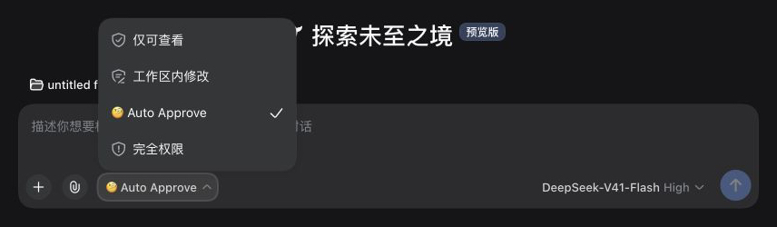
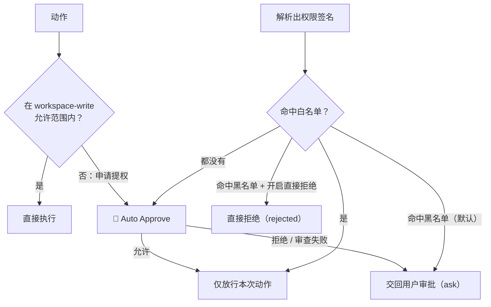

# dsh-auto-pass

[English](README.md) | 中文

`dsh-auto-pass` 为 DeepSeek Harness 的 WebUI 增加 `自动审批` 权限档位。每个需要审批的动作都会先交给一次**单轮模型审查**（不起子代理、不带会话转录，只喂归一化后的动作 + 你最后一条消息），插件只自动放行审查通过（allow）的请求；模型拒绝、宿主安全降级和审查失败一律交回 DSH 原生人工审批链，由用户决定。**唯一的例外是设置里显式打开的「黑名单直接拒绝」**（默认关闭）：打开后命中黑名单的调用直接判为拒绝、不弹审批卡。

在此之上还有两层「权限记忆」：**白名单**（以后直接放行，不再叫模型）与**黑名单**（以后直接转人工，不再叫模型），白/黑名单分**项目**与**全局**两级。规则来源有三种：你在时间线上手动升级/降级、Reviewer 模型在审查时给出的建议规则，以及**连续通过/连续被拒达到阈值后的确认询问**——同一个项目下同一权限连续放行（默认 3 次，插件自动放行与你本人的放行都算）或连续被拒（默认 3 次，模型判定拒绝与你的手动拒绝都算）达到阈值时，插件**先让 DSH 模型把这次动作优化成一条匹配条件**，再弹问题问你是否加入白名单/黑名单（本项目 / 全局 / 不加入）。**只有你确认才会写入**；选「不加入」后这个动作不会再被询问。

当前版本只支持 WebUI。

## 截图

选择 `自动审批` 权限档位（DSH 0.1.5-rc.1，中文界面）：



Reviewer 允许有限的只读操作：


## 工作方式



选择 `Auto Approve` 后，`workspace-write` 允许范围内的普通操作直接执行，不调用 Reviewer。图中展示的是沙箱提权流程；其他工具审批规则也可能触发 Auto Approve。

- 只有会话选择 `Auto Approve` 时，插件才接管 `approval/request`；其他权限档位继续使用 DSH 原有审批链。
- 每次审批只启动一个 `spawn` Reviewer 会话。有限的 `read`、`glob`、`grep` 调查和最终结构化结果都由 DSH 自己的 agent loop 处理，插件不再实现另一套模型/工具循环。
- 审查就是一次普通的模型调用：没有子 Agent、没有工具、读不了文件，也看不到会话历史。喂给它的只有两段 JSON——归一化后的动作（工具名、命令/路径、cwd、是否请求提权）与极简上下文（你最后一条消息 + 最近一次人工回答，各自截断到 `maxEvidenceChars`）。只有最小范围的只读检查可能改变决定时，才可以检查敏感文件。
- Reviewer 会收到精确待审批动作、approval reason、当前权限、按预算截取的原始 session events、主 Agent 已装配的 system 指令，以及 AGENTS.md 等工作区指令。稳定指令会单独序列化为可缓存前缀，位于 session 标识、transcript、权限和动作数据之前。直接用户消息、`ask_user_question` 返回的人工回答、已装配的 system 指令和工作区指令都可以构成授权；assistant 内容和其他工具结果仍是不可信证据。
- 结构化结果只强制要求 `outcome`。简写 `{"outcome":"allow"}` 默认表示 low 风险、unknown 授权；deny 缺少其他字段时默认表示 high 风险、unknown 授权。完整结果还可以包含 `risk_level`、`user_authorization` 和 `rationale`。宿主一定拒绝 critical 风险，也会拒绝用户授权低于 medium 的 high 风险。无效输出、动作参数缺失、超时、非父请求取消导致的基础设施失败和工具失败都不会变成自动拒绝，而是把请求交回用户。
- 模型 deny 不会重新审查，也不会变成自动拒绝：插件会调用下一个审批应答器，让请求继续走 DSH 原生审批链，由用户决定。插件自动给出的结论只有两种：审查通过时的 `allowed-once`，以及**设置里打开「黑名单直接拒绝」后**命中黑名单时的 `rejected`（默认关闭 = 黑名单也只转人工）。
- **名单优先于模型审查**：命中黑名单直接转人工、命中白名单直接放行，两者都不调用模型。黑名单永远压过白名单；项目级规则优先于全局级。
- **权限签名**由「工具名 + 归一化关键参数」得出，与调用 id、时间无关：命令类工具取命令文本（折叠空白），文件类工具取路径参数，其余取按键排序的参数 JSON；提权标记等额外参数也进签名，所以「提权重试」不会被当成普通调用。签名才是"相似权限"的判定单位。
- **连续放行自动升级**统计「最终获准执行」的次数（插件自己放行的、以及你在审批卡上点「允许一次」的都算），连续被拒同理，命中名单的那一次不计入。同一项目下同一动作连续放行达到阈值（默认 3，可在面板改）后，插件会**问你**（本项目 / 全局 / 不加入），确认后才写规则；没有可用的模型建议时**默认写成命令前缀**（例如 `pnpm test`），而不是逐字钉死整条命令的精确签名——换个参数不会立刻失效。选「不加入」后不再为这个动作计数、也不再询问。
- 拿不到精确动作（例如审批请求先于 `tool/call` 到达）时**不建立签名**，这类请求既不参与名单匹配，也不参与计数——否则它们会塌缩成同一个空签名，几次放行后把「所有解析不出参数的调用」一起放行。
- 默认 90 秒总时限覆盖这一次单轮调用（含流式读取）。

主 session 会记录审批事件和简短插件通知（**可在设置里一键关闭**，默认开启）：每次审批**结束后**写进上下文一行摘要，同时给出审查结论与**最终结果**（如 `[人工] 自动审批 未自动批准 bash，已转交你审批 · 最终结果：已拒绝 · 理由：…`）——转人工的请求因此能看到你最终是批准还是拒绝。Reviewer 子 session 使用 `_auto-approve:<callId>` label，并记录消息、调查工具调用与结果、最终 assessment 和 turn end。Console 只记录 session/call 标识、模型路由、步骤数、停止原因、风险、授权和结果，不默认输出完整 prompt 或文件内容。

## 审批面板：审批设置 + 审批时间线

每次审批都会记一条记录。两个面板刻意分开，避免对话区被审批噪声占满：**对话区标签页放「审批设置」，右侧栏放「审批时间线」**。宿主通过 `/api/dsh-auto-pass/log`、`/policy`、`/rule` 提供数据，由插件的客户端半渲染。

「审批设置」包含：连续放行阈值（改完即生效，写入策略文件的全局段）、**全局**与**项目**两级的白名单/黑名单列表（每条规则显示标签、来源（手动/模型/记忆）、匹配条件，可**编辑**（改标签或匹配条件，按 id 原地更新）或单独删除；**同一条规则不会出现两份**——工具 + 匹配条件相同的再添加就是**更新**那条，新规则若已被已有规则完全覆盖则**不重复写入**并如实提示，新规则若覆盖了已有的窄规则会把窄规则**合并掉**），以及一张与设置页相同的配置卡片——面板显示位置 + 三个开关：**注入审批结果到上下文**（关闭后模型上下文里不会再出现任何审批结果）、**黑名单直接拒绝**（命中黑名单直接把调用判为拒绝，不再弹人工审批卡）、**自动打开审批时间线**（只要触发审批、且时间线没打开，就自动把右侧栏时间线展开；时间线已经显示在眼前时不抢焦点，刷新页面也不会因为历史记录而弹开）。开关都是标准 switch 控件，写进 DSH 设置命名空间 `dsh-auto-pass`、改完立即生效、跨重启保留。能管理项目规则的前提是能确定当前项目目录——插件会先问宿主会话列表，拿不到就退回本会话最新一条审批记录里的 `cwd`。

「审批时间线」顶部有**快捷筛选**——`全部` / `白名单` / `黑名单` / `自动` / `人工` 五个 chip，每个 chip 后面是它在当前范围（本次会话 / 全部会话）里的条数；白名单、黑名单看这次审批是否命中名单规则，自动只看**模型审出来的放行**、人工只看**你最终拍板的**——后两类都排除命中名单的记录，所以**四类互不重叠，四个条数相加正好是总数**；白名单 / 黑名单 / 自动 / 人工可**多选叠加**（点亮多个时显示满足任一条件的记录），点 `全部` 清空筛选。每行直接显示**审批意见**与**命中名单**（白名单/黑名单 + 作用域 + 规则标签），不展开也能看出这次为什么放行或转人工；匹配条件有三种：命令前缀、精确签名、路径前缀（这次动作用不上的那种会直接禁用，免得生成命不中的规则）；路径前缀支持**单层**通配（`D:/work/x/src/*.js`，只匹配该目录下的文件），跨目录的 `**` 会被拒绝。展开任意一条记录，即可把它**升级为白名单**或**降级为黑名单**，作用域可选「本项目」或「全局」。规则内容默认填 Reviewer 在本次审查里给出的**建议规则**（模型产出，可覆盖同类动作，例如 `command_prefix: pnpm test`），记录里没有**可用的**模型建议时（例如审查未完成就转人工）默认回落到该次动作的**命令前缀**（没有命令的动作才回落到精确签名）；**这块表单可以直接改**——匹配条件（命令前缀 / 精确签名 / 路径前缀）、匹配值、规则标签都由你定，四个按钮按你填的内容写入，不再经过模型。模型建议若明显写错（实测出现过把「精确签名」写成 `danger-full-access` 这种一句描述的），插件会判定它**不覆盖这次动作**、直接丢弃并回落到本次精确签名，不会写进名单。

- 放置位置沿用 [`dsh-context`](https://github.com/bowenliang123/dsh-context) 的模型：对话区里和「对话/轨迹」并排的标签页（`conversation.view`）放审批设置、右侧栏标签页（`sidebarRightTabs`）放时间线，或两处都放。`placement: all`（默认）两处都注册，对话区标签页立刻可见；`auto` 表示优先右侧栏、右侧栏座位不可用时退回对话标签页——因此不装任何第三方侧边栏插件也能用。只想留一处就用 `tab` / `sidebar`。
- 设置页卡片（`settings.plugin.item`，位于 设置 → 插件）可即时切换位置，选择写进 DSH 设置命名空间 `dsh-auto-pass`、跨重启保留，并优先于 `placement` 配置值。**注意**：设置页只为宿主侧注册过设置命名空间的插件渲染卡片，所以插件的 host 半会注册这个命名空间（客户端卡片的 key 必须与它同名）。
- 每行显示时间、**第几轮第几步**、工具名、结论（`自动批准` / `转人工` / `直接拒绝` / `审查未完成`）、审批意见摘要，以及命中名单时的白/黑名单标记；转人工的还会显示你最终的选择；展开可见风险等级、用户授权、轮次/步数、理由、审批原因、动作参数（裁剪到 500 字符）与耗时（单轮审查后不再有 Reviewer 会话与调查步数，旧记录里仍会显示）。
- 记录以 JSON 落盘、跨重启保留，并且**按工作区分文件**：`$DSH_HOME/dsh-auto-pass/records/<工作区>.json`（默认 `~/.dsh/dsh-auto-pass/records/`，没有 cwd 的记录进 `unknown.json`），每个工作区各自保留最新 1000 条，先写临时文件再改名；面板把各工作区合并成一条时间线读。升级到本版本时会自动把旧的单文件 `$DSH_HOME/dsh-auto-pass/approvals.json` 按工作区拆开（全部写成功才删原文件，重复 id 只留一条）。`logFile` 显式指定路径可退回单文件模式，`maxRecords` 改每个工作区的上限。记录只存本地审批数据，并且只在 localhost 上提供。
- 策略分两个文件：全局 `$DSH_HOME/dsh-auto-pass/policy.json`（阈值、全局名单、连续计数），项目 `<会话 cwd>/.dsh-auto-pass/policy.json`（项目名单）。计数统一记在全局文件里并用 `cwd` 前缀区分项目，所以项目目录只在你真的给它写了项目规则之后才会多出一个 `.dsh-auto-pass/` 目录（该目录已列进本仓库的 `.gitignore`，建议你也忽略它）。写盘失败只告警：项目规则写不进去会自动降级写全局，绝不因为策略落盘失败而改变审批结论。

## 安装

包名为 `dsh-auto-pass`。从 GitHub 安装：

```sh
dsh plugin --profile web add github:sujingkpo/dsh-auto-pass
```

也可以从本地检出安装：

```sh
dsh plugin --profile web add link:/path/to/dsh-auto-pass
```

重启 WebUI 后，在会话的 Permissions 选择器中选择 `Auto Approve`，也可以在 General Settings 中设为默认权限档位。

## 配置

随包配置默认使用 `deepseek-official/deepseek-v4-flash` 与 `high` 推理：

```yaml
- id: dsh-auto-pass
  name: dsh-auto-pass
  config:
    language: auto
    reviewerProvider: deepseek-official
    reviewerModel: deepseek-v4-flash
    reviewerReasoningEffort: high
    timeoutMs: 90000
    maxEvidenceChars: 400
    maxActionChars: 16000
    maxOutputTokens: 2048
    maxRecords: 1000
    placement: all
    notice: true
    denyDirect: false
    autoOpenTimeline: true
    askRejectReason: true
    autoApproveAfter: 3
    policyFile: ''
```

`notice`（默认 `true`）控制是否把审批结果注入模型上下文，`denyDirect`（默认 `false`）控制命中黑名单时是否直接拒绝，`autoOpenTimeline`（默认 `true`）控制「只要触发审批、且时间线没打开」时是否自动打开它，`askRejectReason`（默认 `true`）控制**你拒绝一次审批后是否追问一句拒绝理由**（追问卡的第一项就是本次的模型审批意见，点一下即可；也可以自己写，或选「不留言」）。四者都能在设置页的插件卡片或「审批设置」面板里改，设置里的值优先于这里的默认值；`notice` 是总开关——关掉后审批结果与拒绝理由都不会写进模型上下文，追问也随之停掉。

`language` 可设为 `auto`（默认）、`zh` 或 `en`；非法值会发出警告并回退为 `auto`。自动模式会累计当前 session 中由用户直接发送的消息所含汉字：达到 4 个时选择中文，否则选择英文；Agent 指令、助手消息和工具结果不参与判断。Reviewer 会被明确要求使用直接用户 prompt 的语言书写理由。为避免翻译改变审查语义，两种模式下安全策略正文都保持中文。

`reviewerProvider` 和 `reviewerModel` 必须同时设置。两者都省略时，Reviewer 使用父 session 当前的 provider/model。profile 覆盖会替换同一 bundle 行的完整 `config`，因此应重复写出所有需要保留的值。

`autoApproveAfter` 是连续放行阈值的**缺省值**，面板里改过的值存在策略文件里并优先于它（必须 ≥ 1）。`policyFile` 改全局策略文件路径，留空表示用默认路径。

Reviewer persona 和补充安全规则分别位于 `prompts/policy-template.md` 与 `prompts/policy.md`。修改配置、策略或插件代码后需要重启 DSH。

## 许可证

[MIT](LICENSE)
